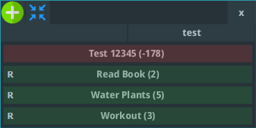
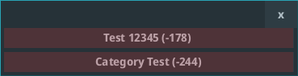
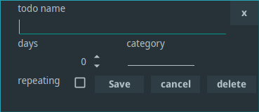
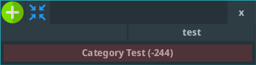

# re-todo

Desktop Application for managing reaccuring TODO tasks.

   
   
   
   

---

# How To Use
- Add new tasks with the green button
- Minimize to todo-tasks with the collapse button
- left click tasks to set their status as done
- right click existing tasks to edit them

# Features
- Set tasks as repeating after <x> days
- Categorize your tasks
- Minimize to undone tasks

# Configuration File
* Windows: %AppData%\Roaming\retodo.conf
* Linux: /home/[user]/.local/share/applications/retodo.conf

# Themes
The theme can be set as a JVM argument: lite,ocean,mars.  
java -jar re-todo.jar `theme`

# Libraries Used
* [Lombok](https://github.com/projectlombok/lombok)
* [material-ui-swing](https://github.com/vincenzopalazzo/material-ui-swing)

# License
GPLv3

# Author
*Simon Lixenfeld 2022*