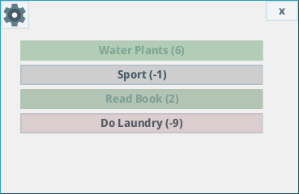
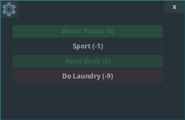
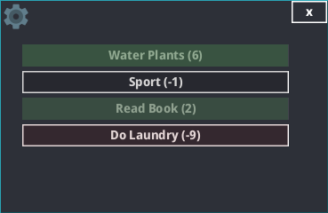

# re-todo

Desktop Application for managing reaccuring TODO tasks.

---

# How To Use
* Open re-todo.jar

# Configuration File
* Windows: %AppData%\Roaming\retodo.conf
* Linux: /home/[user]/.local/share/applications/retodo.conf

# Themes
The theme can be set as a JVM argument: lite,ocean,mars.  
java -jar re-todo.jar `theme`

# Libraries Used
* [Lombok](https://github.com/projectlombok/lombok)
* [material-ui-swing](https://github.com/vincenzopalazzo/material-ui-swing)

# License
GPLv3

# Author
*Simon Lixenfeld 2022*